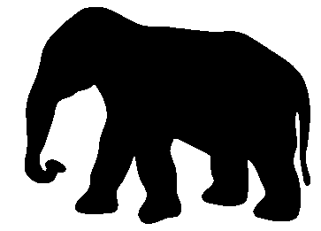

# Elephant de Fermi et Neumann
Une animation montrant le dessin de l'éléphant de Fermi et Neumann généré à l'aide des épicycles en python.

## Description

Ce projet illustre la méthode des épicycles pour reconstruire un contour à partir de séries de Fourier obtenuees à partir du dessin :

## Installation
Clonez le repository et exécutez `python3 dessine_elephant.py` pour générer l'animation.

dépendances cf le fichier requirements.txt

## Contributeurs
Moi même ;)
